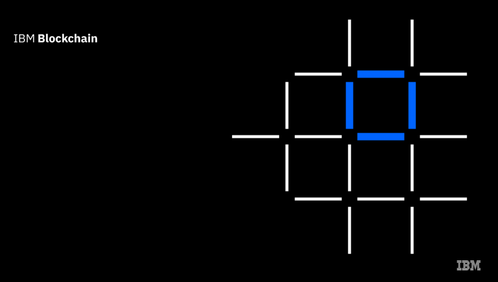

<h1 align="center">Projeto para aprendizado em smart contracts</h1>

```javascript
@Author Johnny Carvaho
@Date 2022-07-17
```

## Principais tecnologias utilizadas: <br/>
<p>
  
  
  
</p>

## Resumo do projeto

```
Este é um projeto para aprendizado na tecnologia blockchain
iremos executar smart contracts e obter mais conhecimento nas 
tecnologias envolvidas. 
```


## ETAPA 1

### Objetivos desta etapa
- Aprender oque é a tecnologia blockchain
- Configurar ambiente de desenvolvimento

### Resumo

```
Nessa etapa, abordamos o básico do blockchain; este é o termo usado para descrever a tecnologia de contabilidade 
distribuída que usa contratos inteligentes para compartilhar transações de várias partes com as organizações membros 
de uma rede de negócios. Aprendemos sobre o Linux Foundation Hyperledger Project, que visa desenvolver tecnologias 
de blockchain para negócios, e o Hyperledger Fabric, que é uma implementação de contabilidade compartilhada que 
sustenta muitos projetos de blockchain. Por fim, analisamos o IBM Blockchain Platform, que é um conjunto de ferramentas 
e serviços para construir e operar blockchains baseados em Hyperledger Fabric. A extensão do IBM Blockchain 
Platform VS Code é uma dessas ferramentas e é o que usaremos nestes tutoriais.

No próximo tutorial, vamos criar nosso primeiro contrato inteligente.
```


## ETAPA 2
### Objetivos desta etapa
- Criar um novo projeto de contrato inteligente
- Implemente um contrato inteligente básico usando um modelo padrão
- Entenda o que o contrato inteligente faz


## Passo 1: 


